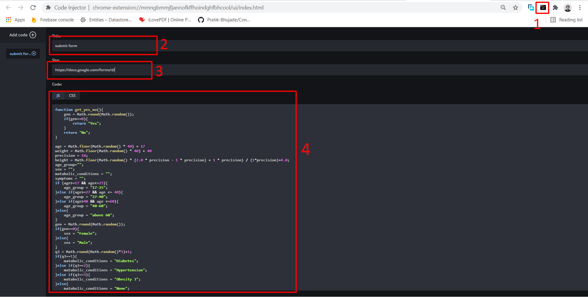

# auto-fill-and-submit-google-form

## How to use:  ##
Step 1: Write script according to your google form.  
        (Method is explained in the script file using comments and steps)  
Step 2: Download this chrome Extension in your PC  
        https://chrome.google.com/webstore/detail/code-injector/mmngbmmjfjannofkffhoindghfbhcool  
Step 3: Click on the extension icon and paste you entire code in code->JS section.  
Step 4: Enter the Following URL in Site option:  
        https://docs.google.com/forms/d/  
Step 5: Give any Title to your script.  
Step 6: Now go to this URL and press F12:  
        https://docs.google.com/forms/d/  

### If you see random minutes on console, congratulations you are successfull. You need to wait then.  ###

## How to Stop your script:  ##
Step 1: Click on the extension icon.  
Step 2: You have 2 options  
        1: You can remove everything from given extension fields. (you will lose your code)  
        2: You can put some random characters on Site: field. (your code will be saved)  

## In case of errors or any assistance ##
https://www.facebook.com/jawadadil6  
Drop me an email at adiljay05@gmail.com  

## How to use Screenshots ##

